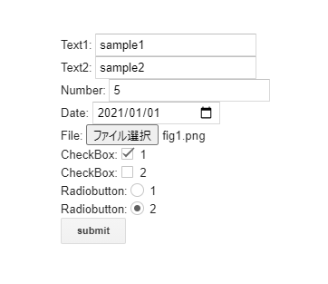
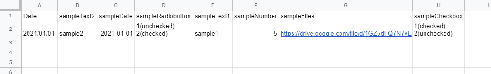

# Parser for Sending HTML Form Object to Google Apps Script using google.script.run

<a name="top"></a>
[](LICENCE)

<a name="overview"></a>

# Overview

This is a Javascript library for sending the HTML form object to Google Apps Script using `google.script.run`.

<a name="description"></a>

# Description

HTML form object is parsed by this library, and the object can be sent to Google Apps Script using `google.script.run`. After the V8 runtime got to be able to be used for Google Apps Script, when the file input tag is included in the HTML form object, the object sent to Google Apps Script using `google.script.run` cannot be directly used. Because it seems that the binary file data cannot be parsed when it is sent with `google.script.run`. [Ref](https://stackoverflow.com/a/60748334) In the current stage, as the workaround, the file data is required to be sent to Google Apps Script using `google.script.run` after it was converted to the byte array and the base64 data. I think that this might be resolved in the future update. But I thought that as the current workaround, when the parser for converting this is prepared, it might be useful for users, because I saw the several questions which have this issue at Stackoverflow.

This Javascript library was created by updating the sample script at [this report](https://tanaikech.github.io/2020/09/04/using-values-submitted-from-html-form-using-google-apps-script/) as a Javascript library.

<a name="install"></a>

# Install

```html
<script src="htmlFormObjectParserForGoogleAppsScript_js.min.js"></script>
```

Or, using jsdelivr cdn

```html
<script src="https://cdn.jsdelivr.net/gh/tanaikech/HtmlFormObjectParserForGoogleAppsScript_js@master/htmlFormObjectParserForGoogleAppsScript_js.min.js"></script>
```

# Usage

This library is used for sending the form object from HTML&Javascript side to Google Apps Script side using `google.script.run`. The simple sample script is as follows.

```html
<script src="https://cdn.jsdelivr.net/gh/tanaikech/HtmlFormObjectParserForGoogleAppsScript_js@master/htmlFormObjectParserForGoogleAppsScript_js.min.js"></script>

<form>
  Text: <input type="text" name="sampleText" /><br />
  File: <input type="file" name="sampleFiles" multiple /><br />

  <input
    type="submit"
    name="button"
    value="submit"
    onclick="main(this);return false;"
  />
</form>

<script>
  async function main(e) {
    const obj = await ParseFormObjectForGAS(e.parentNode); // Heare, this library is used.
    google.script.run
      .withFailureHandler((err) => console.log(err.message))
      .withSuccessHandler((res) => console.log(res))
      .getFormValues(obj); // The form object parsed by this library is used here.
  }
</script>
```

## Options

In the current version, the method of `ParseFormObjectForGAS` has 3 arguments like `ParseFormObjectForGAS(formObj, fields, excludeTypes)`. [Ref](https://github.com/tanaikech/HtmlFormObjectParserForGoogleAppsScript_js/blob/master/htmlFormObjectParserForGoogleAppsScript_js.js)

- `formObj` : This is the form object from HTML form.
- `fields` : Fields value. Default is `"name,type,value,files,checked"`. In this case, the object, which has the properties of `name,type,value,files,checked`, is returned.
- `excludeTypes` : Exclude types. Default is "submit". In this case, for example, at above HTML form, the property of button is not included in the returned object.

# Sample script 1

As a sample script for using this library, please do the following flow.

This sample script has a HTML form. When the values and files are inputted to HTML form and click the button, the form object is parsed by this JS library, and tha parsed form object can be sent to Google Apps Script using `google.script.run`.

## 1. Create new Google Spreadsheet.

In order to test this library using a sample script, please create new Google Spreadsheet and open the script editor.

## 2. Prepare scripts.

Please copy and paste the following scripts to the script editor.

### Google Apps Script side: `Code.gs`

```javascript
const doGet = (_) =>
  HtmlService.createHtmlOutputFromFile("index").setTitle("sample HTML form");

function getFormValues(formObject) {
  const folderId = "###"; // Please set the folder ID. The uploaded file is put to this folder.

  const sheet = SpreadsheetApp.getActiveSpreadsheet().getSheetByName("Sheet1"); // In this sample, the values are put to "Sheet1".
  const lastRow = sheet.getLastRow();
  let header = [];
  if (lastRow > 0) {
    header = sheet.getRange(1, 1, 1, sheet.getLastColumn()).getValues()[0];
    if (header[0].trim().toLocaleLowerCase() != "date") {
      throw new Error(
        `Please set "Date" to the 1st colum in the 1st header row in your Spreadsheet.`
      );
    }
  }
  if (header.length == 0) header = ["Date", ...Object.keys(formObject)];
  const values = [
    header.map((h) => {
      if (h.trim().toLocaleLowerCase() == "date") {
        return new Date();
      } else if (formObject[h].some((e) => e.files)) {
        const folder = DriveApp.getFolderById(
          folderId == "###" || !folderId ? "root" : folderId
        );
        return formObject[h]
          .reduce((ar, e) => {
            if (e.files && e.files.length > 0) {
              e.files.forEach(({ bytes, mimeType, filename }) => {
                ar.push(
                  folder
                    .createFile(Utilities.newBlob(bytes, mimeType, filename))
                    .getUrl()
                );
              });
            } else {
              ar.push("");
            }
            return ar;
          }, [])
          .join("\n");
      } else if (
        formObject[h][0].type == "checkbox" ||
        formObject[h][0].type == "radio"
      ) {
        return formObject[h]
          .map(
            ({ checked, value }) =>
              `${value}(${checked ? "checked" : "unchecked"})`
          )
          .join("\n");
      }
      return formObject[h].map(({ value }) => `${value}`).join("\n");
    }),
  ];
  if (lastRow == 0) values.unshift(header);
  sheet
    .getRange(lastRow + 1, 1, values.length, values[0].length)
    .setValues(values);
  return "Done";
}
```

### HTML&Javascript side: `index.html`

```html
<script src="https://cdn.jsdelivr.net/gh/tanaikech/HtmlFormObjectParserForGoogleAppsScript_js@master/htmlFormObjectParserForGoogleAppsScript_js.min.js"></script>

<form>
  Text1: <input type="text" name="sampleText1" /><br />
  Text2: <input type="text" name="sampleText2" /><br />
  Number: <input type="number" name="sampleNumber" /><br />
  Date: <input type="date" name="sampleDate" /><br />

  File: <input type="file" name="sampleFiles" multiple /><br />

  CheckBox: <input type="checkbox" name="sampleCheckbox" value="1" />1<br />
  CheckBox: <input type="checkbox" name="sampleCheckbox" value="2" />2<br />

  Radiobutton: <input type="radio" name="sampleRadiobutton" value="1" />1<br />
  Radiobutton: <input type="radio" name="sampleRadiobutton" value="2" />2<br />

  <input
    type="submit"
    name="button"
    value="submit"
    onclick="main(this);return false;"
  />
</form>

<script>
  async function main(e) {
    const obj = await ParseFormObjectForGAS(e.parentNode);
    google.script.run
      .withFailureHandler((err) => console.log(err.message))
      .withSuccessHandler((res) => console.log(res))
      .getFormValues(obj);
  }
</script>
```

## 3. Deploy Web Apps.

The detail information can be seen at [the official document](https://developers.google.com/apps-script/guides/web#deploy_a_script_as_a_web_app).

1. On the script editor, at the top right of the script editor, please click "click Deploy" -> "New deployment".
2. Please click "Select type" -> "Web App".
3. Please input the information about the Web App in the fields under "Deployment configuration".
4. Please select **"Me"** for **"Execute as"**.
   - This is the important of this workaround.
5. Please select **"Anyone"** for **"Who has access"**.
   - In this case, the user is not required to use the access token. So please use this as a test case.
   - When you want to use the access token, please set it to `Anyone with Google account` or `Only myself`. By this, the user can access to the Web Apps using the access token. When you use the access token, please include the scope of `https://www.googleapis.com/auth/drive.readonly` or `https://www.googleapis.com/auth/drive`.
6. Please click "Deploy" button.
7. When "The Web App requires you to authorize access to your data" is shown, please click "Authorize access".
8. Automatically open a dialog box of "Authorization required".
   1. Select own account.
   2. Click "Advanced" at "This app isn't verified".
   3. Click "Go to ### project name ###(unsafe)"
   4. Click "Allow" button.
9. Copy the URL of Web App. It's like `https://script.google.com/macros/s/###/exec`.
   - **When you modified the Google Apps Script, please redeploy as new version. By this, the modified script is reflected to Web Apps. Please be careful this.**

## 4. Testing.

In order to test this, please access to the copied URL of `https://script.google.com/macros/s/###/exec` using your browser. By this, you can see the following HTML form.



When the HTML form like above image is submitted, the following object is sent to Google Apps Script side. At above script, it's `obj` of `const obj = await ParseFormObjectForGAS(e.parentNode)`. The keys of this object are from `name` of each tag in above HTML form.

```json
{
  "sampleRadiobutton": [ <--- In this property, there are 2 same name of "sampleRadiobutton". By this, this array has 2 elements.
    {
      "checked": false,
      "name": "sampleRadiobutton",
      "type": "radio",
      "value": "1"
    },
    {
      "checked": true,
      "value": "2",
      "name": "sampleRadiobutton",
      "type": "radio"
    }
  ],
  "sampleCheckbox": [
    {
      "name": "sampleCheckbox",
      "checked": true,
      "value": "1",
      "type": "checkbox"
    },
    {
      "checked": false,
      "type": "checkbox",
      "value": "2",
      "name": "sampleCheckbox"
    }
  ],
  "sampleText1": [
    {
      "type": "text",
      "name": "sampleText1",
      "checked": false,
      "value": "sample1"
    }
  ],
  "sampleDate": [
    {
      "checked": false,
      "value": "2021-01-01",
      "name": "sampleDate",
      "type": "date"
    }
  ],
  "sampleNumber": [
    { "name": "sampleNumber", "type": "number", "checked": false, "value": "5" }
  ],
  "sampleText2": [
    {
      "name": "sampleText2",
      "value": "sample2",
      "checked": false,
      "type": "text"
    }
  ],
  "sampleFiles": [ <--- When multiple files are uploaded, those files are included in this array.
    {
      "value": "fig1.png",
      "files": [
        {
          "mimeType": "image/png",
          "bytes": [1, 2, 3, , ,],  <--- This is the byte array of uploaded file.
          "filename": "fig1.png"
        }
      ],
      "checked": false,
      "name": "sampleFiles",
      "type": "file"
    }
  ]
}
```

For example, if the input tags with the same name are existing, those are included in the array. And, when the multiple flies are uploaded, those are also parsed and you can retrieve those files from the array.

At Google Apps Script side, the values are put to the Spreadsheet as follows. If you use this sample script, please modify this for your actual situation.



# Sample script 2

The form object parsed by this library has the property of `type`. So you can filter the form object by `type` at Google Apps Script side as follows.

```javascript
function getFormValues(formObject) {
  const res = Object.assign(
    Object.entries(formObject).filter(([_, [{ type }]]) => type == "checkbox")
  );
}
```

# IMPORTANT

- In the current stage, the maximum size of blob for Google Apps Script is 50 MB. So when you want to upload the file with the size over 50 MB, it is required to use the resumable upload of Drive API. [Ref](https://github.com/tanaikech/AsynchronousResumableUploadForGoogleDrive)

# References

- [Using Values Submitted from HTML Form using Google Apps Script](https://tanaikech.github.io/2020/09/04/using-values-submitted-from-html-form-using-google-apps-script/)

---

<a name="licence"></a>

# Licence

[MIT](LICENCE)

<a name="author"></a>

# Author

[Tanaike](https://tanaikech.github.io/about/)

If you have any questions and commissions for me, feel free to tell me.

<a name="updatehistory"></a>

# Update History

- v1.0.0 (February 13, 2021)

  1. Initial release.

[TOP](#top)
